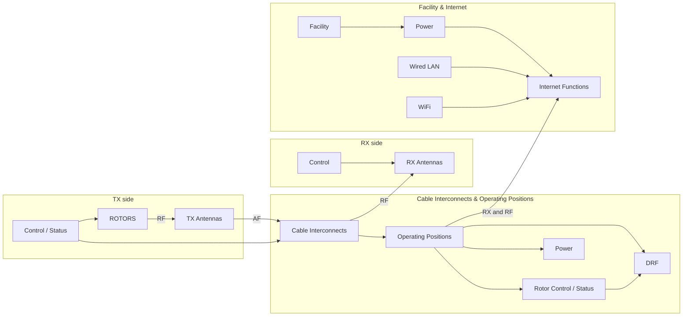

# RF System Architecture (from sketch)

## Blocks

| Area | Blocks |
|------|--------|
| **TX** | TX Antennas, ROTORS (RF to antennas), Control/Status (to ROTORS) |
| **Center** | Cable Interconnects, Operating Positions, DRF, Rotor Control/Status, Power |
| **Infra** | Facility → Power → Internet Functions (inputs: RX and RF from OP, Wired LAN, WiFi); Internet Functions to the right of Facility |
| **RX** | RX Antennas (RF from Cable Interconnects), Control (to RX Antennas) |
